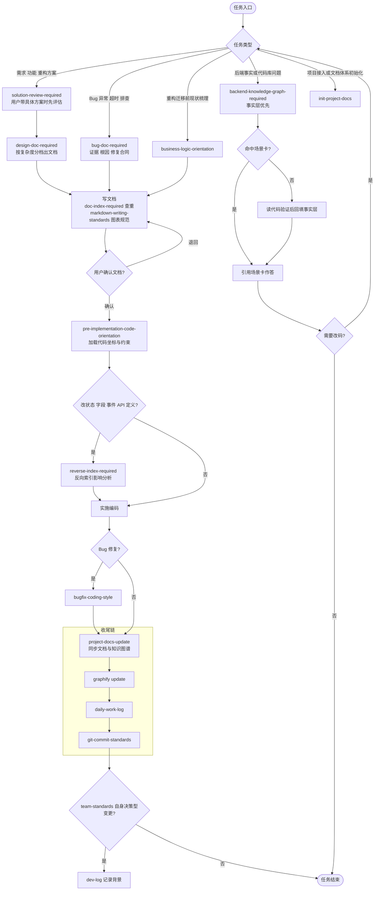

# team-stand 技能路由图

本文档描述 21 个 team-stand 技能的触发路由：入口按任务类型分流、文档与实施之间的硬门禁、改码后的收尾链。Agent 使用的紧凑文本路由在用户级 `~/.omp/agent/AGENTS.md`（每会话开场注入）；本文档是给人看的完整版。单一事实源始终是各 `SKILL.md` 的 `description`，两者冲突时以 SKILL.md 为准。

---

## 1. 主流程图

---

## 2. 横切技能

不在主流程链上、按场景独立触发的技能：

| 技能 | 触发时机 |
|------|---------|
| `glossary-required` | 需求 / 讨论 / 文档中出现缺失、歧义或与代码命名不一致的业务术语 |
| `coding-violation-log` | 用户纠正 AI 编码规范、分层、命名或依赖方向错误时；编码前回顾既有违规记录 |
| `comment-cleanup` | 用户明确要求批量清理存量注释、版本标记、死代码（不自动触发） |
| `wiki-health-check` | 用户手动要求文档体检 / 查重 / 健康检查（不自动触发） |
| `java-coding-standards` | 写、审查、修改 Java 源码（实施链内与 `coding-standards-common` 叠加） |
| `dev-log` | team-standards 仓库决策型变更（图内收尾链末端判定） |

---

## 3. 事实源与维护规则

- **单一事实源**：各 `SKILL.md` 的 `description`。harness 每个 session 自动注入技能列表并按 description 匹配触发。
- **两份路由的分工**：用户级 `~/.omp/agent/AGENTS.md` 的文本路由段给 agent 用（开场注入、紧凑）；本文档的流程图给人看（理解全链路、新人 onboard）。
- **冲突裁决**：路由描述与 SKILL.md 不一致时，以 SKILL.md 为准，并当天修正路由。
- **维护义务**：修改任何技能的触发时机或链路顺序时，必须同步更新本文档的图与 AGENTS.md 的文本路由段，决策型变更写 `docs/dev-log/`。
