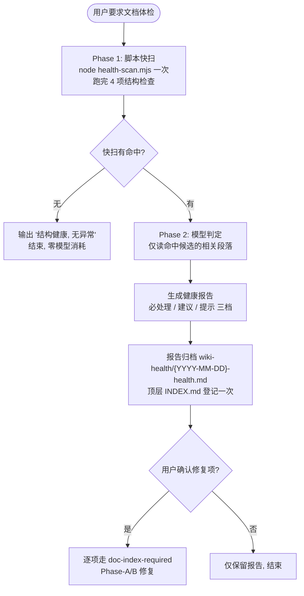

# 知识库健康检查

## 核心原则

**默认零消耗：本 skill 纯手动触发，不挂接任何自动流程。** 用户说「文档体检 / wiki 健康检查 / 查重 / 检查文档」时才执行。

**报告只列问题，不自动修复。** 所有修复动作（合并、补登记、刷新文档）必须经用户逐条确认，且走 `doc-index-required` 的 Phase-A/B 流程。

## 检查对象

`{USER_DOCUMENTS}/ai-docs/{project}/` 下的 `design/`、`bug/`、`orientation/` 等手写文档子目录及其 `INDEX.md`。

**豁免目录**（脚本层直接跳过，不报告）：`knowledge-graph/`、`generated/`、`work-log/`、`wiki-health/`、`glossary/`、各 `INDEX.md` 自身。

## 执行流程




## Phase 1: 脚本快扫（node 一次性完成）

四项检查合并为 `node health-scan.mjs <知识库根目录> [代码仓库目录]` 一次执行，输出精简清单：
（Windows 上 node.exe 在 PATH 中稳定可用；git 经 `execFileSync` 直调，绕开 shell 与 WSL bash 存根；中文正则原生 Unicode，无 locale 依赖）

### 检查项 1：索引失真

- 有文件无 INDEX 条目（孤立页面）
- 有 INDEX 条目无文件（死条目）
- 实现要点：递归列出 `*.md`（排除 INDEX.md）与 INDEX 的 `##` 标题及条目内 `文件：` 行做集合差；`-current.md` 需去掉后缀再比对

### 检查项 2：跨目录主题聚簇

- 按 INDEX 摘要/标题的关键词聚合各子目录条目
- 实现要点：INDEX 标题按 `[\u4e00-\u9fa5a-zA-Z]{2,}` 切词；同一词出现在 ≥2 个子目录即列为聚簇候选；标题相似度高的条目对（如仅差「无法」「误用」等措辞）单独标注「疑同一主题」

### 检查项 3：过时基线

- 文档落笔后其涉及的代码文件是否有新提交
- 实现要点：
  - 文档 frontmatter 有 `base_commit` 时：`git log <base_commit>..HEAD -- <涉及文件>`
  - 无基线时降级：`statSync().mtimeMs` 取文档 mtime，`git log --since=@<mtime> -- <涉及文件>`，非空即标记
  - 涉及文件从文档正文中的代码路径提取（如 `src/main/java/...`）
- 只标记数量与提交主题，不展开 diff

## Phase 2: 模型判定（仅命中时）

| 候选类型 | 判定动作 | 读取范围 |
|---|---|---|
| 疑同一主题条目对 | 读两文档首段摘要，判定合并/区分边界 | 各文档前 30 行 |
| 主题聚簇 | 确认是否需要交叉引用链接或概念页 | 仅标题与摘要行 |
| 过时基线命中文档 | 读 `git log <基线>..HEAD` 提交主题 + 文档核心结论，判断是否真被推翻 | 提交标题 + 文档结论段 |
| 矛盾抽查 | 仅对聚簇内文档对做结论比对，不做全库漫扫 | 命中文档对 |

## 健康报告格式

```markdown
# wiki-health 报告 · {project} · {YYYY-MM-DD}

## 必处理
- {索引失真/死条目，附具体文件与 INDEX 名}

## 建议
- {聚簇候选，列文档路径；疑同一主题的标注判定结论}
- {过时基线，附落后提交数与提交主题}

## 提示
- {交叉引用缺失统计；无实体页的高频概念}

## 豁免说明
- {跳过的生成层目录}
```

归档到 `{KB}/wiki-health/{YYYY-MM-DD}-health.md`；`wiki-health/` 首次出现时在顶层 `INDEX.md` 登记一行（仅一次，后续报告不重复登记）。

## 红色警告

| 想法 | 正确处理 |
|---|---|
| "每个会话自动跑一次更安全" | 错。纯手动 opt-in，用户不要求就不跑 |
| "发现问题直接顺手修掉" | 错。报告只列问题；修复需用户确认并走 Phase-A/B |
| "knowledge-graph 下有文件没进 INDEX，报告出来" | 错。生成层投影全部豁免 |
| "过时基线的文档直接刷新" | 错。刷新是 `project-docs-update` 的职责，本 skill 只标记 |
| "全库逐篇读一遍做矛盾检测" | 错。模型只读命中候选，全库漫扫消耗过高 |
| "报告也写进 design/ 或 bug/" | 错。报告固定放 `wiki-health/`，避免污染文档树 |
| "用 bash/sh 跑扫描脚本" | 错。脚本为 `health-scan.mjs`，用 `node` 执行；Windows 上 PATH 里的 bash 可能是 WSL 存根（挂死/报错），且 grep/locale 对中文不可靠 |
